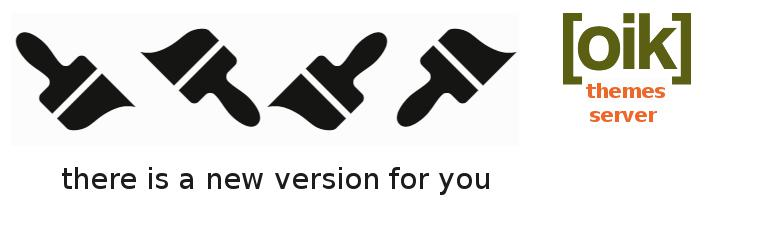

# oik themes server 

* Contributors: bobbingwide
* Donate link: https://www.oik-plugins.com/oik/oik-donate/
* Tags:  themes, server, shortcodes, FREE, premium
* Requires at least: 4.9.8
* Tested up to: 6.4-RC3
* Stable tag: 1.4.6
* License: GPLv2 or later
* License URI: http://www.gnu.org/licenses/gpl-2.0.html

## Description 
oik-themes server for FREE, Themium and Bespoke oik-themes

## Installation 
1. Upload the contents of the oik-themes plugin to the `/wp-content/plugins/oik-themes' directory
1. Activate the oik-themes plugin through the 'Plugins' menu in WordPress
1. Visit Settings > Permalinks to properly register the new custom post types ( oik-themes, oik_themeversion and oik_themiumversion )
1. To support oik Premium themes use oik options > Server settings to define a secure folder used to store uploaded zip files
1. Also install and activate either oik-edd or oik-woo to allow the creation of API keys

## Frequently Asked Questions 

# Can I deliver bespoke themes? 
Can I deliver unique themes to my customer without having the themes listed on the website?

* Answer: Yes. You can have them listed as premium themes (themium) but don't associate them with a product.
No users will be able to purchase the product so only those with an API key and who already have the theme installed will be able to download the updates.
OR use Bespoke themes.

# How do I do this? 
One way of doing this:

1. create the product
2. create the theme attaching the product to the theme
3. buy the product
4. get an API key
5. unpublish the product
6. create the themium version
7. continue to create themium versions

only those users with API keys will be able to upgrade.

# Is there another way? 
Yes, classify the theme as "Bespoke"
This won't create a download button but the theme will be accessible if the user knows the theme name.

## Screenshots 
1. oik themes server settings
2. edit oik-theme
3. display oik-theme

## Upgrade Notice 
# 1.4.6 
Upgrade for PHP 8.2 support.

## Changelog 
# 1.4.6 
* Fixed: Cater for themes with no gradient and/or no palettes #16
* Tested: With WordPress 6.4-RC3 and WordPress Multisite
* Tested: With Gutenberg 16.9.0
* Tested: With PHP 8.0, PHP 8.1 and PHP 8.2
* Tested: With PHPUnit 9.6

## Further reading 
If you want to read more about the oik plugins then please visit the
[oik plugin](https://www.oik-plugins.com/oik)

